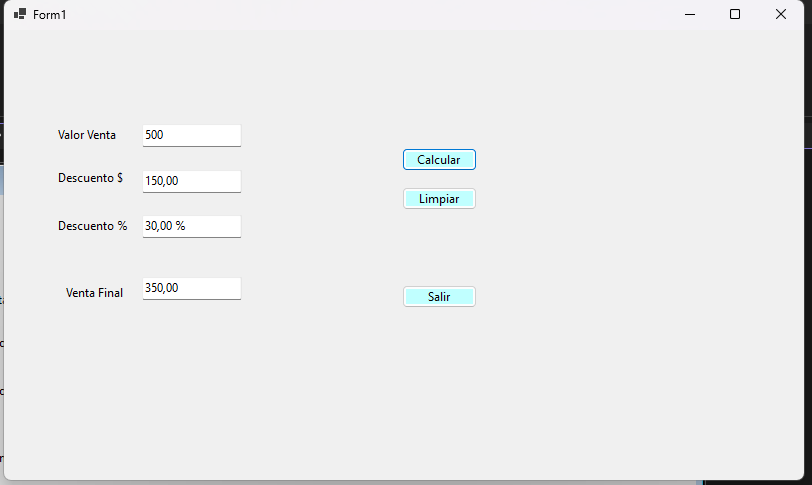
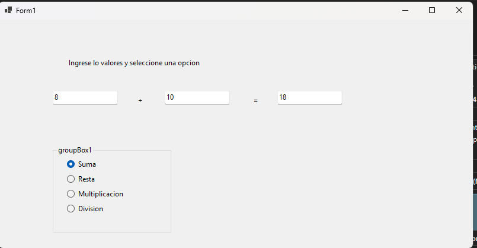

# Laboratorio 1 - HPA3

## Información del laboratorio

| Dato | Información |
|---|---|
| **Asignatura** | Herramientas de la Programación Aplicada III (.NET) |
| **Laboratorio** | Laboratorio #1 |
| **Estudiante** | Cristell Peters |
| **Grupo** | 1II133 |
| **Carrera** | Ingeniería en Sistemas y Computación |
| **Institución** | Universidad Tecnológica de Panamá |
| **Año** | 2026 |
| **Fecha de ejecución** | 15/04/2026 |

---

## Objetivos

🟠 Aplicar los conocimientos básicos de programación en C#.

🟠 Trabajar con aplicaciones Windows Forms utilizando .NET Framework.

🟠 Utilizar controles como Label, TextBox, Button, GroupBox y RadioButton.

🟠 Implementar estructuras condicionales para resolver problemas.

🟠 Aplicar propiedades y métodos de los controles de Windows Forms.

---

## Contenido del laboratorio

En este laboratorio se desarrollaron tres prácticas utilizando C# y aplicaciones Windows Forms. Cada práctica permite aplicar diferentes conceptos relacionados con el manejo de controles, eventos y estructuras de programación.

Las prácticas incluidas en el repositorio son:

🟠 **Controles**

🟠 **Descuentos**

🟠 **EstructuraIf**

---

## Tecnologías utilizadas

🟠 **Lenguaje:** C#

🟠 **Plataforma:** .NET Framework

🟠 **Tipo de aplicación:** Windows Forms

🟠 **IDE:** Visual Studio

🟠 **Control de versiones:** Git / GitHub

---

## Requisitos previos

Para ejecutar los proyectos se necesita:

🟠 Windows.

🟠 Visual Studio.

🟠 Soporte para proyectos de C# Windows Forms (.NET Framework).

🟠 Git, en caso de querer clonar el repositorio.

---

# Prácticas desarrolladas

## 1. Controles

En esta práctica se desarrolló una aplicación de Windows Forms utilizando diferentes controles como `Label`, `TextBox` y `Button`.

El botón **Mostrar** permite presentar la fecha completa a partir de los datos ingresados, mientras que el botón **Finalizar** muestra mensajes al usuario y posteriormente cierra la ventana.

También se trabajó con la propiedad `Text`, los operadores `+` y `+=` y el uso de `MessageBox.Show()`.

### Evidencia

---

## 2. Descuentos

En esta práctica se desarrolló una aplicación para calcular el descuento correspondiente a una venta según su valor.

| Valor de la venta | Descuento |
|---|---:|
| $500 o más | 30% |
| Más de $300 hasta $499 | 20% |
| Más de $100 hasta $299 | 10% |
| $100 o menos | 0% |

El programa muestra el porcentaje de descuento, el monto descontado y el valor final de la venta.

Para los controles se utilizó la nomenclatura indicada en la práctica:

🟠 `lbl` para Labels.

🟠 `btn` para Buttons.

🟠 `txt` para TextBoxes.

### Evidencia

---

## 3. EstructuraIf

En esta práctica se desarrolló un formulario utilizando un `GroupBox` para agrupar las opciones disponibles.

El usuario ingresa los valores y selecciona mediante `RadioButton` la operación que desea realizar. La operación cambia dependiendo de la opción seleccionada.

Las operaciones consideradas son:

🟠 Suma

🟠 Resta

🟠 Multiplicación

🟠 División

### Evidencia

---

